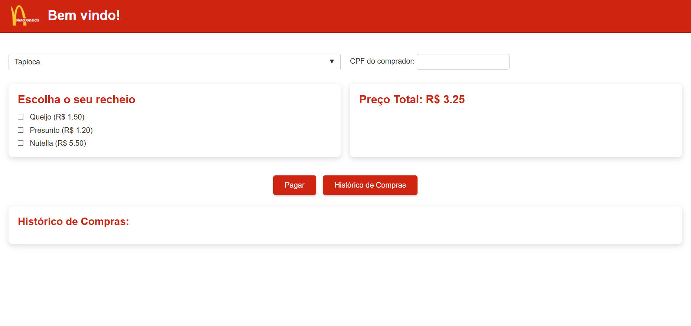

# Projeto NetoDonalds

O NetoDonalds é um sistema de ponto de venda simplificado, inspirado em redes de fast-food, desenvolvido como um projeto fullstack. Ele permite que os usuários selecionem tipos de comida (como tapioca e cuscuz), personalizem seus pedidos com diversos recheios, informem o CPF para registro e visualizem o histórico de compras. O sistema utiliza Node.js para o backend, HTML, CSS e JavaScript puro para o frontend, e PostgreSQL para armazenamento de dados.

## Design do Projeto



## Funcionalidades Implementadas

### Frontend
- **Seleção de Comida:** Escolha do tipo de lanche (ex: Tapioca, Cuscuz) através de um menu dropdown dinâmico.
- **Seleção de Recheios:** Múltiplos recheios podem ser selecionados via checkboxes.
- **Cálculo de Preço:** O preço total é calculado e atualizado em tempo real (preço base da comida + preços dos recheios selecionados).
- **Registro de CPF:** Campo para inserção do CPF do comprador.
- **Pagamento:** Botão "Pagar" que envia os detalhes da compra para o backend.
- **Histórico de Compras:** Botão "Histórico de Compras" que busca e exibe as compras anteriores associadas a um CPF informado.
- **Interface do Usuário:** Estilização com CSS moderno, incluindo um sistema de alerta modal personalizado para feedback ao usuário.

### Backend (Node.js com Fastify)
- **`GET /foods`**: Retorna uma lista de todas as comidas base disponíveis.
- **`GET /food/:id`**: Retorna os detalhes de uma comida específica (pelo ID) e a lista de recheios associados a ela.
- **`POST /payment`**: Registra uma nova compra no banco de dados. Recebe ID da comida, CPF, data do pagamento, descrição do pedido (comida + recheios) e preço total.
- **`GET /history/:cpf`**: Retorna o histórico de compras de um cliente específico, identificado pelo CPF, ordenado por data.

## Tecnologias Utilizadas
- **Frontend:** HTML5, CSS3, JavaScript (ES6+)
- **Backend:** Node.js, Fastify
- **Banco de Dados:** PostgreSQL
- **Controle de Versão:** Git & GitHub

## Estrutura do Projeto
- **`Front-end/`**: Contém os arquivos `index.html`, `style.css` e `script.js` responsáveis pela interface e interatividade do usuário.
- **`Back-end/`**: Contém a lógica do servidor Node.js (`server.js`, `controller.js`, `repository.js`, `database.js`) e o arquivo `package.json` para gerenciamento de dependências.
- **`Database/`**: Contém os scripts SQL (`01_tables.sql`, `02_foods.sql`, `03_fillings.sql`) para a criação da estrutura do banco de dados e inserção de dados iniciais.

## Como Executar o Projeto

### 1. Pré-requisitos
- Node.js e npm instalados.
- PostgreSQL instalado e em execução.
- Um cliente SQL para PostgreSQL (como pgAdmin ou DBeaver) para executar os scripts do banco.

### 2. Configuração do Banco de Dados
   a. Crie um novo banco de dados no PostgreSQL chamado `netodonalds`.
   b. Execute os scripts SQL localizados na pasta `Database/` na seguinte ordem:
      - `01_tables.sql` (cria as tabelas `foods`, `fillings`, `payments`)
      - `02_foods.sql` (popula a tabela `foods` com dados iniciais)
      - `03_fillings.sql` (popula a tabela `fillings` com dados iniciais)
   c. Verifique e, se necessário, ajuste as credenciais de conexão com o banco de dados no arquivo `Back-end/src/database.js`. Por padrão, está configurado para:
      - `user: 'postgres'`
      - `password: '1234'`
      - `host: 'localhost'`
      - `port: 5432`
      - `database: 'netodonalds'`

### 3. Configuração e Execução do Back-end
   a. Navegue até a pasta `Back-end/` no seu terminal:
      ```bash
      cd Back-end
      ```
   b. Instale as dependências do projeto:
      ```bash
      npm install
      ```
   c. Inicie o servidor backend:
      ```bash
      npm run dev
      ```
   d. O servidor estará rodando em `http://localhost:8080` (ou na porta configurada no `server.js`).

### 4. Execução do Front-end
   a. Abra o arquivo `Front-end/index.html` em qualquer navegador web moderno (Google Chrome, Firefox, Edge, etc.).
   b. A aplicação frontend se comunicará com o backend (que deve estar em execução).

## Dev Log


- [x] Criação da rota **/payment** e da tabela payment.
- [x] Implementação do endpoint `/history/:cpf` no backend.
- [x] Implementação da funcionalidade de histórico de compras no frontend.
- [x] Melhorias de estilo e UX, incluindo modais de alerta personalizados.
- [x] Implementação de menu dropdown para seleção de comidas.


- [x] Apromiramento do front-end.
  - [x] Integração com o Back-end
  - [x] Leitura dos dados da comida e dos recheios
  - [x] Instalação do cors no server.js


- [x] Criação do início do front-end.
  - [x] Criação dos arquivos index.html, style.css e script.js
  - [x] Inclusão da logo do projeto na pasta Front-end/imgs


- [x] Criação da tabela **fillings** e criação da rota /food/:id.
  - [x] A rota **/food/:id** retorna uma comida identificada pelo id, como também os recheios associados a ela


- [x] Criação da base de dados e início do back-end.
  - [x] Criação da estrutura de arquivos do servidor (server.js, controller.js, repository.js e database.js)
  - [x] Criação da tabela **foods** (SQLs na pasta Database)
  - [x] Criação da rota inicial **/foods**